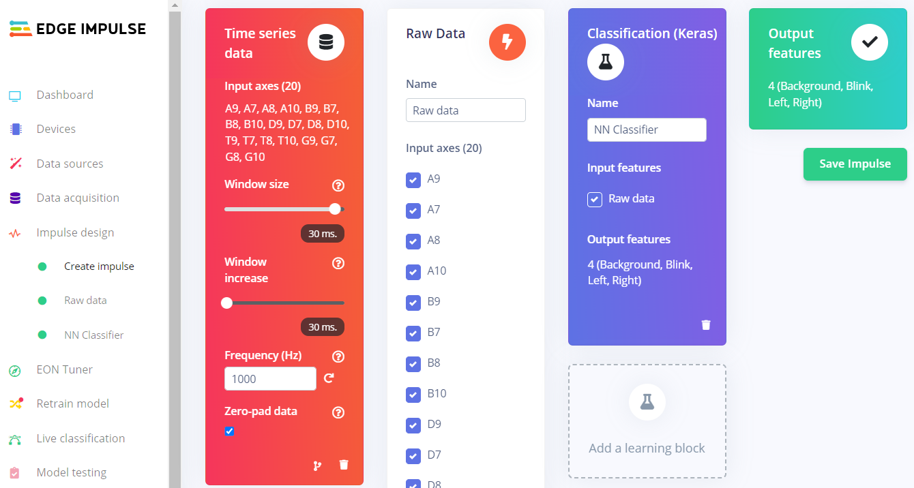
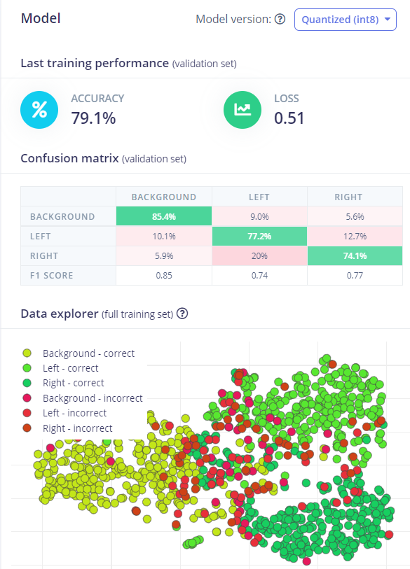
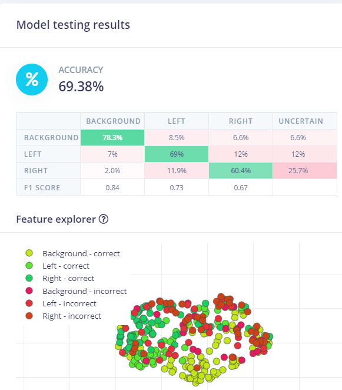
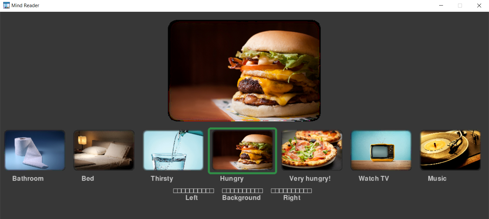

# **Applying EEG Data to Machine Learning, Part 2**

# Objective
The objective of this  tutorial is to show how you, by using a Muse EEG-device, can communicate with the outer world through a computer app. To be precise, this is without moving your limbs or touching the computer at all, instead you "just" need to concentrate! 

While this is a stand-alone tutorial, it is still recommended you check [Part 1](https://docs.edgeimpulse.com/experts/eeg-data-control-games) for background information. If you try to replicate the steps - please do! - it is recommended to start with Part 1 as the learning curve is shallower there.  

<br/>

 


<br/>  

# Introduction


This tutorial is increasing the difficulty level compared to Part 1, which only used eye blinks as triggers. Here limb movement _tries_ are, together with eye blinks, being used to navigate and select images from an image carousel, and even to select letters from the alphabet to communicate through writing. Eye blinks are fairly easy to detect, with or without Machine Learning, as they generate distinct and visible spikes in EEG-data. Motoric movements - or in this tutorial movement tries - do not cause as visible changes in EEG-data, instead they need to be deduced by complex signal analysis and/or Machine Learning.

As mentioned in Part 1, there is a lot of research related to interfacing brain and machine. Patients suffering from ALS (a progressive nervous system disease) have through _invasive_ brain implants been able to communicate with the outer world. 

_Non-invasive_ methods have successfully been used for similar purposes as is done in this tutorial. E.g. [Andrea Kübler and Donatella Mattia](https://www.sciencedirect.com/topics/medicine-and-dentistry/sensorimotor-rhythm) describe how Sensorimotor Rhytm-based (SMR) devices were by test participants used to navigate a remote robot through a labyrinth or to spell using a virtual keyboard.  

The main difference between aforementioned types of clinical EEG-research and this tutorial, is that the first ones are typically using professional EEG-devices with between 16 - 128+ electrodes, while a consumer-based EEG-device like Muse is only having 4 electrodes. More electrodes means both more data as well as data from different brain regions. Especially for SMR-events, electrodes close to the sensorimotor cortex (think top of your skull) are essential, as the signals they measure are closer to the area generating limb movement signals. This in comparison to Muse electrodes which are behind the ears and at the forehead, and are quite far away from the sensorimotor cortex. To improve the situation when using Muse-devices, it is possible to connect an extra electrode to the USB-port, for DIY-persons [this is a comprehensive write-up](https://hackaday.io/project/162169-muse-eeg-headset-making-extra-electrode) on how to build one, and [this conversation](https://openbci.com/forum/index.php?p=/discussion/2634/micro-usb-electrode-options-for-muse-extra-electrode-port) also provides some further info. In this tutorial however, no extra electrode is used, instead the goal is to try to collect more data and of higher quality. 

I got the idea of using Muse for trying to control apps or external devices from Tim de Boer. He has written a series of great blog posts at Medium.com related to EEG-headsets and neuroscience, [this](https://medium.com/building-a-bedroom-bci/collecting-brain-signal-data-using-the-muse-2-eeg-headset-a2d45ae00455) is one of them. 

<br/>  

---------------
# Prerequisites

To be able to reproduce examples found in this tutorial, you'll need:
 - A Muse EEG-device, any model should work, although Muse-01 (from 2014) streams with 220 Hz instead of 256 Hz and might require a few code changes if you are collecting raw data. They cost around 250 USD/EUR and are manufactured by the Canadian company [Interaxon Inc.](https://choosemuse.com/) 
 -  iPhone or Android phone
 - [Mind Monitor app](https://mind-monitor.com/) for iPhone or Android, one-time cost is ~15 USD/EUR
 - A computer able to run Python + WiFi
	 - only PC/Win10 tested although Mac and Linux computers are expected to work
 - Python 3.x  
<br/>  

---------------
# Data flow

The data flow for both Part 1 and Part 2 is:
**Your brain &rarr; Muse &rarr; Bluetooth &rarr; Phone/Mind Monitor &rarr; WiFi &rarr; Computer**  
<br/>

---------------
# Preparations
**Python modules**

 - Install Python-OSC, PYGame, PYGame-menu, and Tensorflow from a command prompt with:
 	- `pip install python-osc` 
	- `pip install pygame` 
	- `pip install pygame-menu` 
	- `pip install tensorflow`
 - The [code repository](https://github.com/baljo/Muse-EEG) (MIT-license) might later include other EEG- and ML-related programs as well.

**Mind Monitor settings**

 - `OSC Stream Target IP`: here you should add your computer's local IP-address, on Win10 you can run `ipconfig` in a command prompt to find it, often starts with 192.168.x.x
 - `OSC Stream Port`: set to `5000`

**Computer**

 - You might need to allow the computer's firewall to allow traffic through port 5000.  
<br/>
<br/>   

---------------
# Step-by-step instructions
## How does it work?

In short, you will here need to collect EEG-data - when trying to move your hands - from your Muse device, and train a ML model in Edge Impulse. The trained model will then be used in the Mind Reader app.

## Process flow

While this is not as complex as brain surgery (:smirk:), it does involve a few steps. The data gathering will also probably require more time than in Part 1, although you can or even should spread it out over a few days. The main steps are listed here and will later on be explained in detail.
1. Collect EEG-data for the events you want to classify, in this case `left`, `right`, and `background` brain "noise"
2. Create a project in Edge Impulse and upload the EEG-data to it
3. Create, train, and test a ML-model in EI
4. Download the trained Tensorflow ML-model to your computer
5. Plug the model into the Mind Reader app and test it
6. Rinse and repeat from 1 as you'll probably need more data.

## Installation

 - Download the following Python programs into a folder you remember
	- [Collect OSC-data.py](https://github.com/baljo/Muse-EEG/blob/main/Collect%20OSC-data.py) which you will use for collecting data
	- [Mind Reader.py](https://github.com/baljo/Muse-EEG/blob/main/Mind%20Reader.py) which is the app itself


## Detailed instructions

In this chapter you will get detailed instructions from start to end on how to collect data, train a model, and test it in practice. While not necessarily every click and detail is listed, you should with normal computer proficiency be able to follow and replicate the steps.

**0. Connect Muse and start streaming**

 - Connect the Muse EEG-device to your phone  

 

 - Wait until the horseshoe in MindMonitor has disappeared and the graph lines for all sensors have calmed down like in the picture. You might need to wait a few minutes to acquire good signals, but it's possible to speed up the process a bit by moisturing the sensors with e.g. a wet finger. 
	- Especially in this tutorial it is very important to have excellent signals, so do not compromise on them!
 - Start streaming from Mind Monitor by clicking on the button showed in the picture  
<br/>

 **1. Collect EEG-data**

 In this step you will, using a Python-program, collect data from your Muse EEG-device.

 - **Edit** `Collect OSC-data.py` with your favourite IDE or with _any_ text editor
	- This Python-program is common for both Tutorial 1 and 2 and possible upcoming tutorials as well, hence you need to comment out code not relevant for this tutorial. Look for the below code snippet in the code and comment (= insert # in front) of the rows related to the Blink Pong game, and remove # in front of the rows related to the Mind Reader app. You can rename the events to whatever you want, but keep in mind that when running inferencing the events will be in alphabetical order, where e.g. `Background` will have index 0, `Left` index 1, and `Right` index 2.

		```
		# Put the events to record in this dictionary within "" and after : the seconds
		# This is used for the Blink Pong game
		rec_dict = {
			"1"     : 2,
			"Noise" : 2
		}  

		# This is used for the Mind Reader app, uncomment below rows and comment all other rec_dict rows
		# rec_dict = {
		#     "Background" : 3,
		#     "Left"       : 3,
		#     "Right"      : 3
		# }
		```
- **Important**: Drink some water, relax a bit, and find a quiet place as next steps will require concentration.
- **Run** `Collect OSC-data.py` from your favourite IDE or from the command prompt with `python "Collect OSC-data.py"`
- To start recording events, click on #1 in MindMonitor (see picture above).
- You will in the terminal window see `Background` for 3 seconds. During this time you should just relax, try to avoid blinking or moving your limbs.
- Next time you'll see `Left` for 3 seconds. During this time you should try or imagine you are moving your left hand. I've found it working better if I actually don't move the hand, or even tension any muscles. It might help to put an object a few centimeters (= an inch or two) in front of your hand, simulating it is just out of reach, and you are unsuccessfully able to reach it.
- Repeat above with the `Right` event.
- The program will record each event in a separate CSV-file.
- It is not easy to concentrate for a long time, especially for the recording done in this tutorial. Hence you are recommended to take a break every now and then. Based on experience, it is also good to remove the EEG-device when not recording and, if you have a longer break, turn it off to save battery. Additionally, next time you use your device it will inevitable be in a slightly different place on your head, and as a result you will probably get a more robust ML-model when recording data.  
<br/>

**2. Create a project and upload EEG-data to Edge Impulse**
- Head over to [Edge Impulse](https://www.edgeimpulse.com/). If you are new to EI, you are recommended to take a look at their great [Getting started](https://docs.edgeimpulse.com/docs/) instructions.
	- Create a project
	- Select `Data acquisition` and click the icon labeled `Upload existing data`
	- Use default settings
	- Upload the files you've recorded in the previous step.   
<br/>

**3. Create a model, train, and test it**

In this section you will first create a ML-model, then train it, and finally test it. This can be most rewarding in case you get excellent performance the first time, but if not, then you need to find out how to improve the model. Hint: ML eats data for breakfast, lunch, and dinner :smiley:

**Create a model**
- Click `Create an impulse` and fill in the `Time series data` as shown in the picture. While the length of the samples are in fact 3000 ms (= 3 seconds), I've found that using 30 ms (as in 30 lines for each sample) works at least as good.
- Add the processing block `Raw data` and let all axes be checkmarked. You can later try to find which axes do not impact much or at all for your model and uncheck them, but then you also need to modify the line `expected_samples = 30` in `Mind Reader.py` accordingly. This is explained more detailed in the code itself.
- Add the learning block `Classification (Keras)`, in this tutorial you will have 3 output features: `Background`, `Left` and `Right`. In the screenshot below also `Blink` is used, but you are recommended to add that one later if you need it. The Mind Reader app actually uses the blink detection feature included in the Muse-device as it removes a complexity layer.  

<br/>
  
<br/>
<br/>

- Click `Save impulse` and `Raw data` on the left hand menu
	- You will see a graph of one of the samples as well as the raw features.


- In this case you don't need to change anything, so click `Save parameters` which will take you to the second tab.

- Click `Generate features`
	- This processes the samples
	- After a while you will see a graph in the Feature explorer. This gives you a view of how well your data can be clustered into different groups. In an ideal situation all similar samples would be clustered into same group with a clear distinction between groups. If that's not the case, no worries at this point, the neural network algorithm will in many cases still be able to do a very good job!  
<br/>  	


<br/>
<br/>  

**Train the neural network**

Here you will train the neural network and analyse its performance.


- Click `NN Classifier` from the left hand menu

- Change the `Number of training cycles` to 200. This is another parameter to tweak, the higher this number is, the longer time the training will take, but also the better the network will perform, at least until it can't improve anymore.
- Click on `Start training`
	- Within a few minutes, depending on the number of labels and data quantity you have, the training will finish.
- The graph shows the training performance and accuracy. In the screenshot it is 79 % which for this type of data is quite good. More important though is the accuracy for unseen data and when the model is in real use. Unfortunately these tend to be worse than the training performance. But for a consumer based EEG-device having only 4 electrodes, an accuracy over 60 % in real use can be considered ok.  
<br/>



<br/>
<br/>
<br/>


**Test the model in Edge Impulse**

In this step you will see how well the model performs with data it has not seen before, and in ideal situations also how the model performs in real use. For this purpose Edge Impulse put away approximately 20 % of the training data when you uploaded it.

- Click on `Model testing` in the menu
- Click on `Classify all`
	- This will run the test samples through the trained model
- After just a short while, depending on the amount of test samples and model complexity, you will get a performance report. Unless you have lots of data or a perfect model, the performance is seldom 100 %. Depending on your use case and what performance you require, you might need to go back a few steps by collecting more and different data, or by tweaking the parameters, to reach your minimum expectations.  
<br/>

  


<br/>
<br/>  
<br/>
<br/>  

**4. Download the trained Tensorflow ML-model to your computer**

Here you will download the trained model to your computer.
- Click `Dashboard` from the left hand menu
- Scroll down to the section `Download block output` and click on the icon next to `NN Classifier model	TensorFlow Lite (float32)`
- Save the file to a folder of your choice (and which you remember as you'll need it soon!)
	- The file will get the name `ei-[ your project name ]-nn-classifier-tensorflow-lite-float32-model.lite`. Although you can rename it if you really want to, why not save your brain cells to more important stuff :smirk:  
<br/>

**5. Plug the model into your app and test it**

Here you will deploy your model and test it out in the wild real world!

**Deploy your model**

- Copy or move the file from the previous step to the folder where you put your Python programs.
- Open `Mind Reader.py` with your favourite IDE or a text file editor like Notepad
	- Scroll to the first function `initiate_tf` and locate the line with `lite_file = "ei-.......lite"`
	- Replace the file name after ` = ` with your own file name, remember the double quotes `" "` and `.lite` at the end

**Test!**

This can be the most rewarding - or most frustrating - phase in the whole process as you'll find out how well you can control the app with your "thoughts".
 - Run the app from your favourite IDE or from the command prompt with `python "Mind Reader.py"`  
 - App usage instructions are found in next chapter  
 - Please note the following:
 	- The model explained in this tutorial is based on 3 second long samples. This also means that the Mind Reader app will collect EEG-data for 3 seconds before trying to classify it and take actions.
	- In the [Github repo](https://github.com/baljo/Muse-EEG/tree/main/Models) you'll find `.lite`-files trained by the author. You can try the app using one of them, without the need to record own EEG-data, but you should be very surprised if they give good results as brains tend to be different...

<br/>
<br/>  

---------------
# App usage instructions

 - Watch [this 2 min. video](https://youtu.be/OwcoYQL4VEU) to get a quick grasp of the app
 - Connect the Muse EEG-device to your phone
 - Start streaming from Mind Monitor by clicking on the button showed in the picture  

<br/>  


 
 - The objective of the app is really to learn how to use your brain and EEG-data to initiate actions. As this is not a game, you are not awarded with points, although it would be a nice addition to the app. Feel free to implement it!
 - As shown in the video - you did watch it, didn't you? - you are presented with an image carousel which can roll left or right. 
 	- Not necessarily all images are shown at the screen at the same time. If you want to add more images, ensure they have same aspect ratio as the example images, and name them `0nn Image Description` where `nn` is a running number between `00` and `99`, and `Image Description` is the text you want to be visible under the image.  

<br/>  


  
 - Similarly as when you collected the training data, you are now expected to try moving your left or right hand to start rolling the carousel. 
 	- The three "health" bars below the images are showing the classification result for each of the three events (Left, Background, Right). The logic is such that if the ML-model classified the EEG-data e.g.: Left=70%, Background=20%, and Right=10% &rarr;&rarr; 7, 2, and 1 green bars would be shown in each of the fields.
	- The health bars are also a biofeedback mechanism in the sense that they can help you to understand the connection between what you are doing (i.e. trying to move a hand), and the corresponding result from the ML-model. This is described in more detail in next chapter. 
 - Blink once when you want to choose an image. This also stops the carousel.


 - When you select the laptop image, you are presented with a text editing field at the bottom of the screen. Similarly as when navigating between the images, you can now navigate left or right through the alphabet, and select a letter by blinking.
 	- As an 'Easter Egg' or very simple text prediction example, why not try writing `EDGE` and see what happens :smiley:
- Double blink (= 2 blinks within 0.7 seconds) when you want to stop writing and go back to the carousel. You can also cheat by pressing `ESC`  
<br/>


  
<br/>  

---------------
# RECOMMENDATIONS FOR FURTHER IMPROVEMENTS
The standard way to improve a ML-model is to gather more data, and then even some more. If that does not help enough, next steps might be to tweak the ML-model, or even change the approach drastically. 

The EEG-data used in this and the previous tutorial is  put into frequency bands by the API Mind-Monitor is using, but you might instead want to try with raw data measured in millivolts (mV), and use Edge Impulse's spectral analysis learning block for further signal processing. The Python-program used in these tutorials is however not collecting raw data, but [this simple Python program](https://github.com/Enigma644/MindMonitorPython/blob/main/OSC%20Receiver%20Simple.py) can be used as a starting point. If you don't want to use the Mind-Monitor app at all, you can instead use [Muse-LSL](https://github.com/alexandrebarachant/muse-lsl)

As earlier mentioned, by using an additional electrode, you might be able to get data closer to the sensorimotor cortex, and as a result increase the performance of the ML-model.

Another idea - that I'm myself interested in trying - is to use the "health" bars as a biofeedback mechanism to record more data, and supposedly more correct data. In practice the Mind Reader app would itself be used for recording data, but recording is done only when the confidence treshold (e.g. 60 %) is reached. So, if e.g. the event was classified to be `Left` with a confidence level of 65 %, the EEG-data recorded for the classification would be stored and imported into Edge Impulse to retrain the ML-model. By repeating this a few times, the resulting ML-model is expected to provide higher accuracy.
  
<br/> 

---------------
# CONCLUSION
That's it! You have now seen how it is possible to use EEG-data to control an app in a more advanced way compared to Tutorial 1. It is undoubtedly more challenging to gather the data and get good accuracy, but when you succeed it is so much more rewarding. 


<div style="text-align: right"> <em>All images are either the author's own or from Wikimedia Commons</em> </div>
